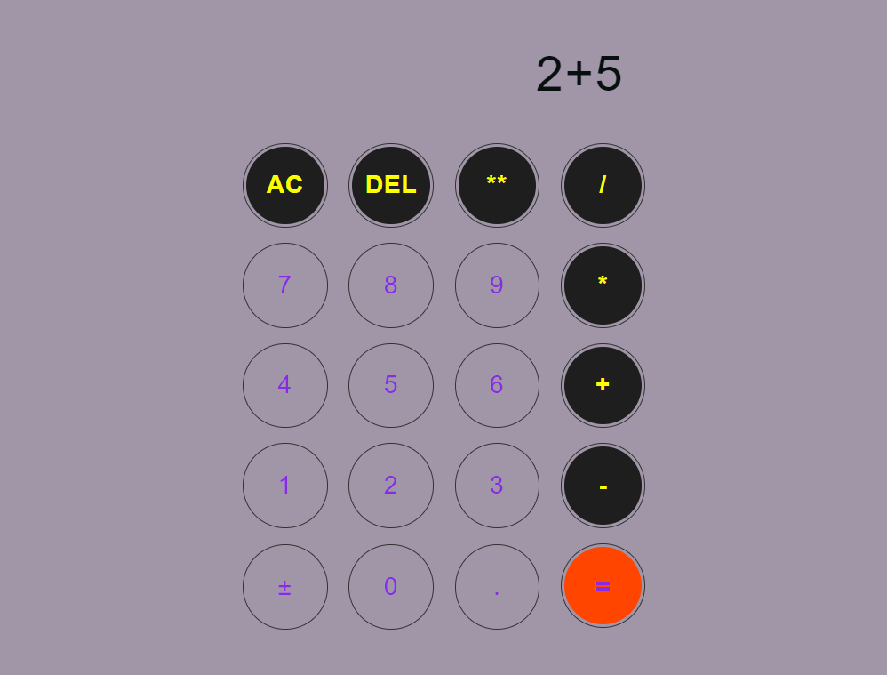
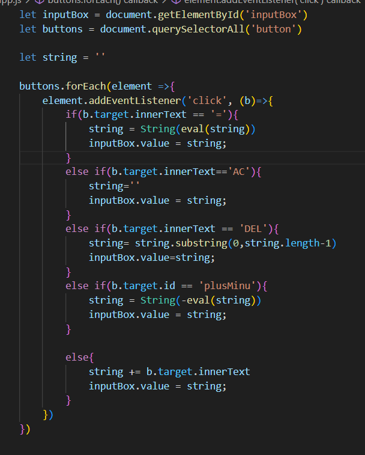
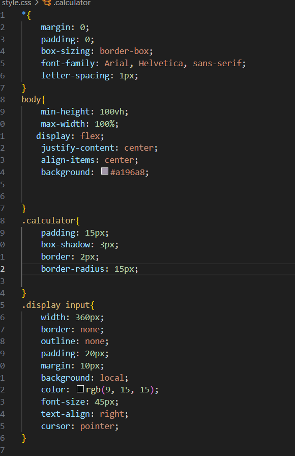
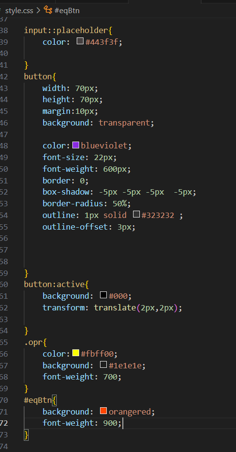
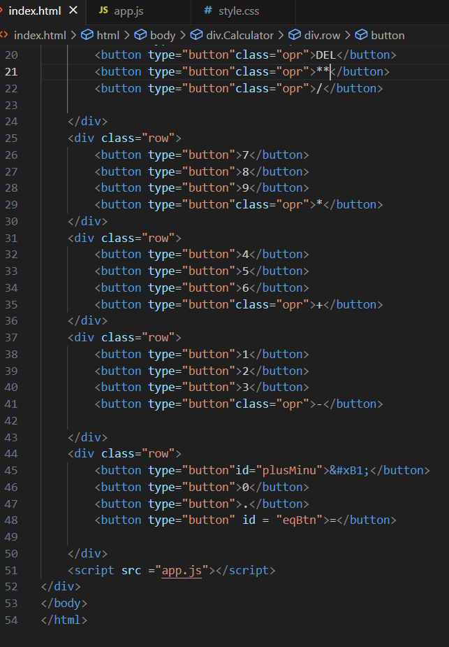

# Calculator

#### Video Demo: <https://youtu.be/DSktOEMtBFo?si=yqDuo4w-GCKcdyj6 >In this video, I talked about me and my final project, and I also ran my project on the website and tried several operations on it

#### Description:
Hi My name is Elaf Fahad Essa Alharbi.I am from Saudi Arabia.I study at the University.I am 21 years old.My major is Computer Science. I heard a lot of my friends praising his role CS50 so I decided to join it so I joined it and learned a lot and today I present to you my final project, which is a calculation machine

 this is my final project for CS50.This scienific calculator is a free tool that solves complex mathematical expressions .I made simple calculator using css, html,and javascript. I use three fails:1: style.css for the style of the program  contains the style the button of calculator ,style the calculator and the background .   2: index.html  contains the title of the program .It contains many columns for the design of automatic calculator buttons and It contains all the buttons such as the operations buttons, the type and number buttons  3:app.js Contains many codes for making calculations. My calculator contains addition ,subtraction , division, multiplication ,and exponents. Also my calculator contains AC to start over DEL to delete part of the plusmius calculation of positive or negative.This my Calculator it is very simple.The color of the calculator is purple,The number buttons are purple and circular,The operations buttons are black and circular, and the equal button is round and red Through this calculator, I can add, subtract, multiply or divide any number. I can also delete part of the process or the whole process.Decimal point can be inserted.You can click on the equal sign to perform the calculation.The result of the mathematical operation appears at the top of the calculator, a new operation can be done on the result of the previous operation or a new calculation can be done by deleting the old operation with the AC button.this code for javascript:  this code for css:   this code for html  this is my code I use three fails:1: style css for the style of the program .2: index.html 3:app.js final statmwnt: Special thanks to the CS50 course, teachers, supervisors and all those in charge of it, as I learned from this course a lot of useful things such as javasript
